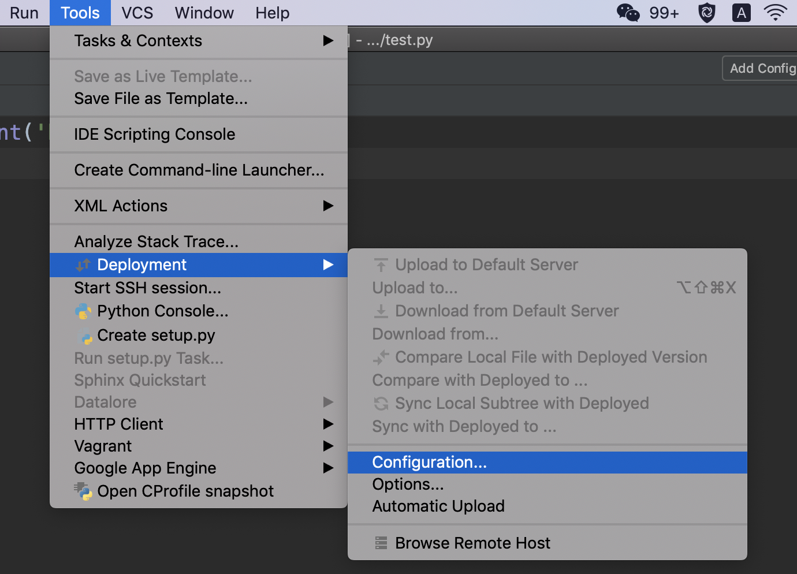
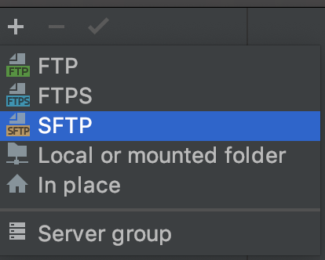
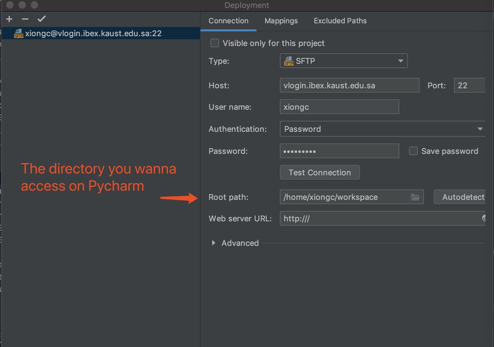
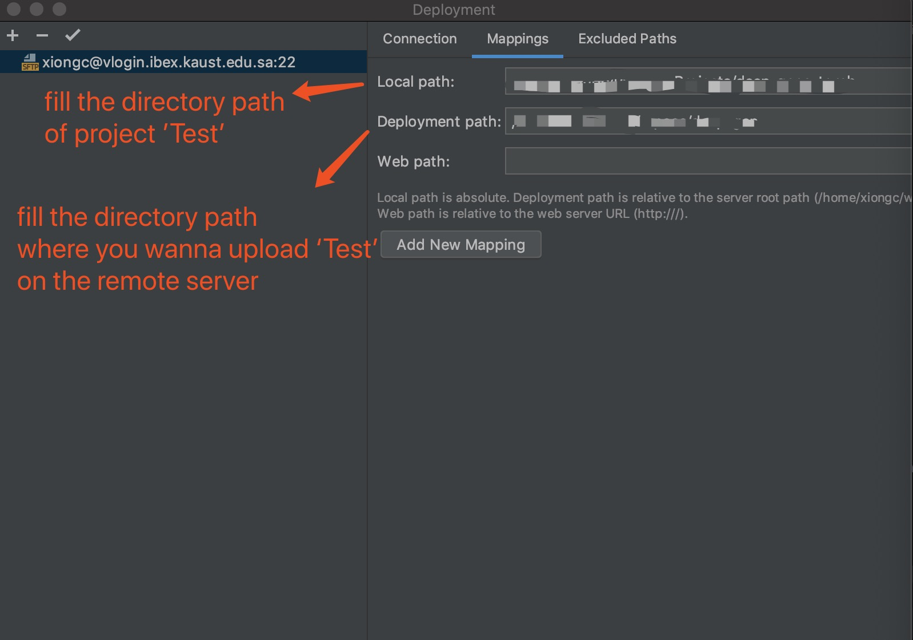
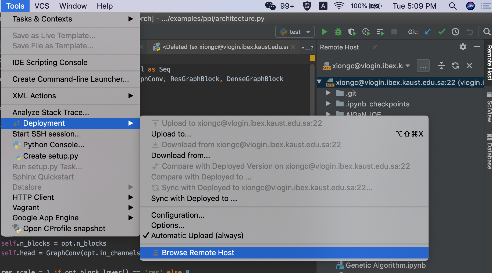
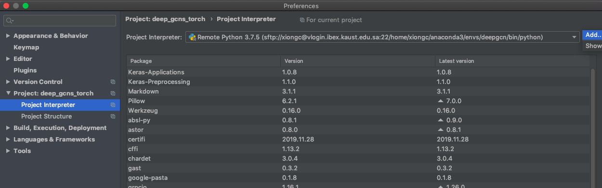
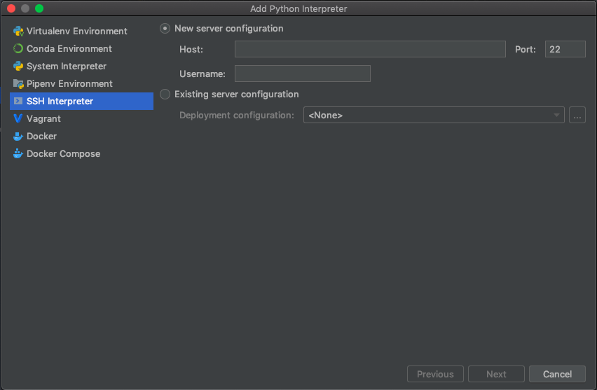
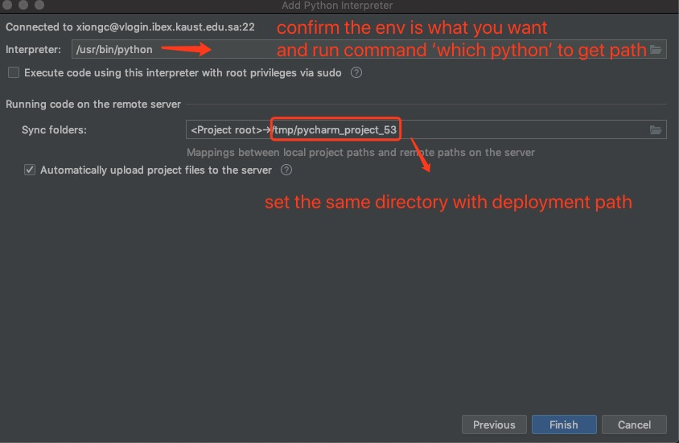

# Play-with-Ibex

> Ibex is a heterogeneous group of nodes, a mix of AMD, INTEL and Nvidia GPUs with different architectures that gives the users a variety of options to work on.
https://www.hpc.kaust.edu.sa/ibex

I only have a portable laptop 💻 
Whenever I need to train models using GPU to accelerate, I cannot count on my own laptop. Thankfully KAUST provides abundant GPUs resources for students.
Therefore, I start my journey of making friends with Ibex.

Let's play with Ibex together!
A. Use Jupyter notebook remotely, so you can run jupyter files from ibex remote server on yous local browser!
B. Use Pycharm installed on your localhost already to run the files on the remote server with GPU!

Actually, A and B can be regarded as simliar ways you could play with ibex happily.

I'm a serious person so I would like to introduce B first.

### Pycharm connects remote server
1. download professional version Pycharm
2. create a project which you wants to run on the remote server (e.g. Test)
3. configure remote server's ip address

Tools -> Deployment -> Configuration

create a new SFTP configuration

fill the relevant connection information

fill the mappings
(the local path is the position where your project is on your localhost and the deployment path is the position you wanna upload your local project on the remote server). 
Pay attention! You only need to fill the rest of part of the whole complete path after exclude the root path you already filled in the previous step. For example, the root path I filled is '/home/xiongc/workspace' and the deployment path I should fill is '/project_name/' instead of '/home/xiongc/workspace/project_name/', otherwise you will have some troubles when the python file is running.
Then click ok button

after the previous operations, the Pycharm console will show the process of uploading all the files to the remote server. Select Tools -> Deployment -> Browse Remote Host, then the pannel on the left part of Pycharm will show the directories and files under the root path you filled for connections configuration page.

4. configure project interpreter

select SSH interpreter 

fill the path obtained by executing command "which python"

Now, you can create a file name 'test.py' under your project directory on Pycharm and try to run it!
